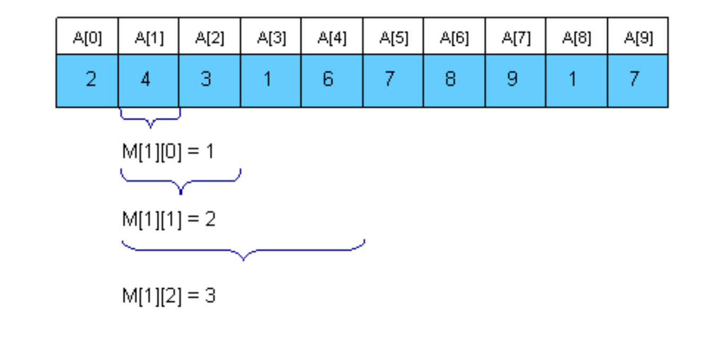
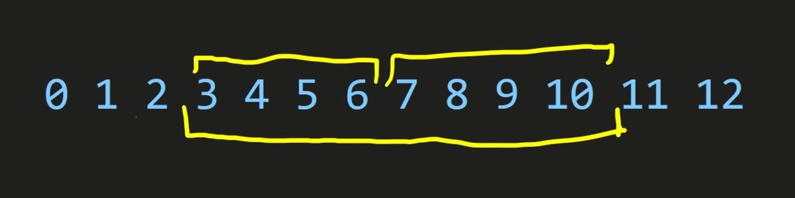
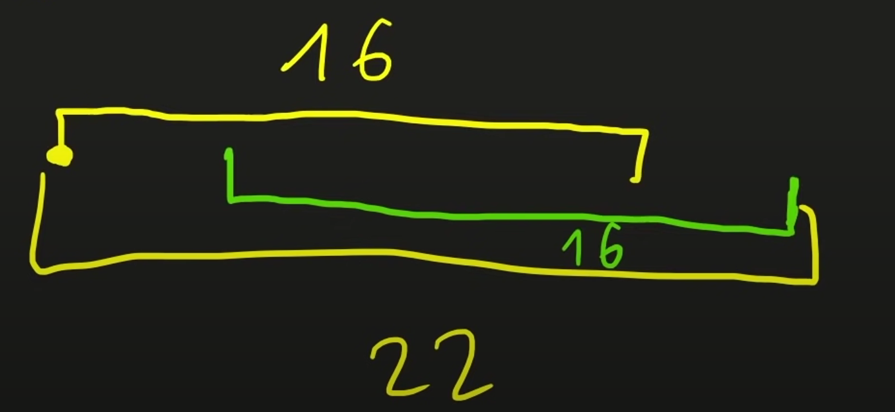

<link rel="stylesheet" type="text/css" href="../styles.css">

# RMQ 
 Range Minimum Query (RMQ) 
 - a data structure used on arrays to find the position of an element with the minimum value between two specified indices 

! The following C++ implementation of RMQ is using a Disjoint Sparse Table.

## Implementation
    struct RMQ {
    vector<int> dp[32];
    
    RMQ(const vector<int> &v) {
        int n = v.size();
        for (int h = 0, l = 1; l <= n; ++h, l *= 2) {
        dp[h].resize(n + 1, 1e9);
        for (int m = l; m < n + l; m += 2 * l) {
            for (int i = m + 1; i <= min(n, m + l); i++)
            dp[h][i] = min(dp[h][i - 1], v[i - 1]);
            for (int i = min(n, m) - 1; i >= m - l; i--)
            dp[h][i] = min(v[i], dp[h][i + 1]);
        }
        }
    }
    int Query(int l, int r) {
        int h = 31 - __builtin_clz(l ^ r);
        return min(dp[h][l], dp[h][r]);
    }
    };

## Description:

Constructor
- Takes as argument the array.

- 

    For intervals of length [1...2k], it will calculate the minimum value in that interval, based on the already calculated intervals (if you have intervals of length 4, and you want to calculate the minimum in an interval of length 8 you just calculate the minimum between two intervals of length 4).
    

Query method

- 

    By using "int h = 31 - __builtin_clz(l ^ r);" we calculate the MSB of the left and right indices in order to find the maximum power of two that fits in the interval and then we find the minimum between the first 2k with the last ones. (If we have an interval of length 22 then we see that we can calculate the minimum between the first 16 and the last 16 elements in that interval)
    

# Resources
<a href="https://www.youtube.com/watch?v=0jWeUdxrGm4&t=340s">Errichto - youtube video</a>

<a href="https://www.topcoder.com/thrive/articles/Range%20Minimum%20Query%20and%20Lowest%20Common%20Ancestor">Topcoder article</a>

