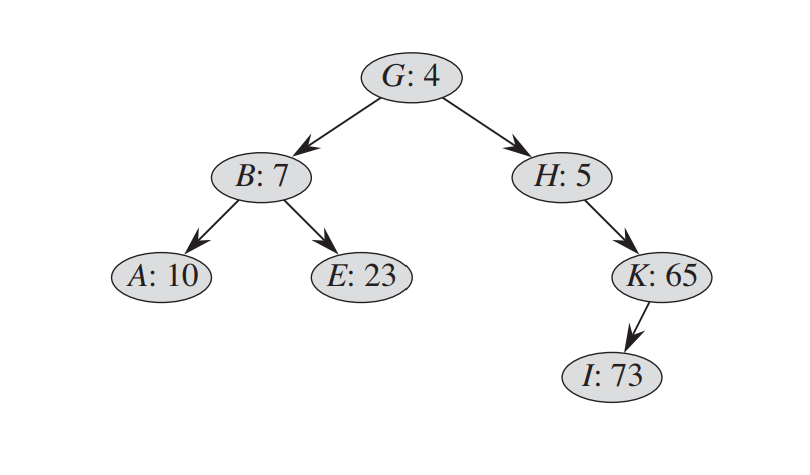

# Treap

A treap is a tree having the property that any node has two values associated with it : key and priority. 

If we only look at the keys of the Vertexes, not taking into consideration the priorities, then it is a BST.

If we only take into account the priorities, then it is a max-heap.

## Declaration:

    struct T {
        int key, priority;
        T *left, *right;
        T() {}
        T(int key, int priority, T* left, T* right) {
            this->key = key;
            this->priority = priority;
            this->left = left, this->right = right;
        }
    } *R, *nil; // nil indica un nod 'gol'

    void init(T* &R) {
        srand(unsigned(time(0)));
        R = nil = new T(0, 0, NULL, NULL);
    }
    
## Search
    int search(T* n, int key) {
        if (n == nil) return 0;
        if (key == n->key) return 1;
        if (key < n->key)
            return search(n->left, key);
        else
            return search(n->right, key);
    }

## Balance
    void rotleft(T* &n) {
        T *t = n->left;
        n->left = t->right, t->right = n;
        n = t;
    }

    void rotright(T* &n) {
        T *t = n->right;
        n->right = t->left, t->left = n;
        n = t;
    }

    void balance(T* &n) {
        if (n->left->priority > n->priority)
            rotleft(n);
        else if (n->right->priority > n->priority)
            rotright(n);
    }

## Insert
    void insert(T* &n, int key, int priority) {
        if (n == nil) {
            n = new T(key, priority, nil, nil);
            return;
        }
        if (key < n->key)
            insert(n->left, key, priority);
        else if (key > n->key)
            insert(n->right, key, priority);

        balance(n);
    }
    insert(R, key, rand() + 1); // adăugăm 1 deoarece prioritatea 0 o are doar nodul nil

## Erase
    void erase(T* &n, int key) {
        if (n == nil) return;

        if (key < n->key)
            erase(n->left, key);
        else if (key > n->key)
            erase(n->right, key);
        else {    
            if (n->left == nil && n->right == nil)
                delete n, n = nil;
            else {
                (n->left->priority > n->right->priority) ? rotleft(n) : rotright(n);
                erase(n, key);
            }
        }
    }

## Split
Sometimes we would like to split the tree into two sub-trees T< and T>

    void split(T* &R, T* &Ts, T* &Tg, int key) {
        insert(R, key, infinity);
        Ts = R->left, Tg = R->right;
        delete R, R = nil;
    }

## Join
Sometimes we would like to join to treaps, one with all keys < than a certain key and the other with all keys > than the same key

    void join(T* &R, T* Ts, T* Tg, int key) {
        R = new T(key, 0, Ts, Tg);
        erase(R, R->key);
    }
    Complexitate: O(log N).
## References

Corman \
https://www.infoarena.ro/treapuri