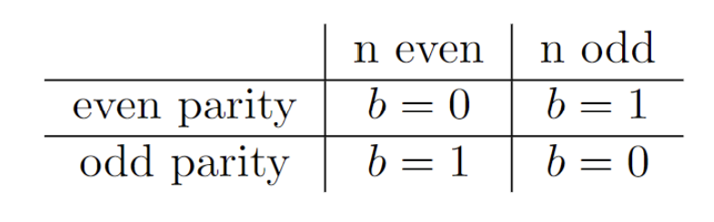
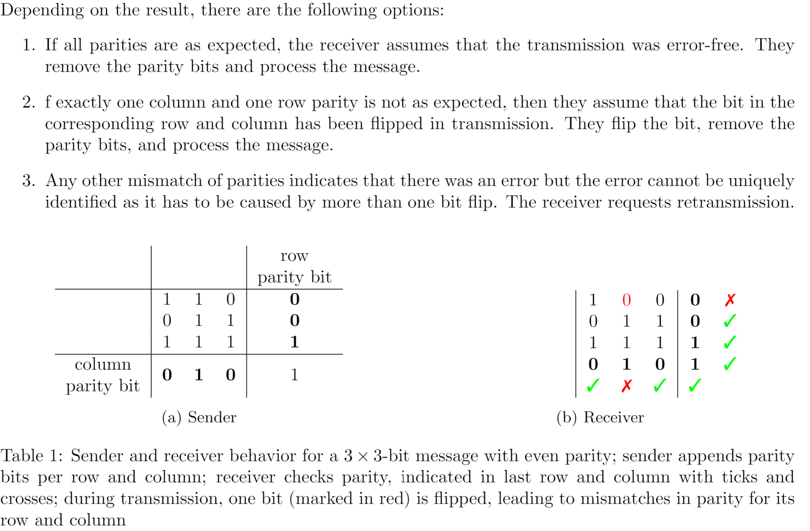

<link rel="stylesheet" type="text/css" href="../styles.css">

<!--  -->

<!--  
 
!   -->
# Error Detection and correction

 Error detection and correction 
 - deal with one or multiple bits flipped during transmission from a sender to a receiver.

 Error detection
 - means that the receiver can identify that there has been an error but they are typically not able to tell which error occurred.As a consequence, the sender has to be given a signal that they have to
retransmit the message

 Error correction
 - allows the receiver to identify the exact bit or bits that have been flipped. The receiver can
hence correct the error without retransmission.

### Choosing an error detection/correction algorithm

! Note that no algorithm can detect or correct all errors; error detection and correction only considerably reduce the probability of errors to be forwarded to the next higher layer.

 Amount of redundancy (overhead)
 - the number of additional bits added. 

## 1. Error Detection

### 1.1 Parity Bits
 Parity 
 - whether a number (of items) is even or odd. 

The algorithm works as follows:
-  Preparation 
 Sender and Receiver agree on the desired parity.
-  Sender 
 has message M. They count the number n of 1s in the message. Then they
append one bit b as follows:

-  Receiver   The receiver gets the message M ′, consisting of a message and a parity bit. They count
the number of 1s in M ′. If the parity is as agreed with the sender, the receiver assumes that the
received message is correct. They remove the last bit and process the actual message.

### 1.2 Parity Words and Internet Checksum

The algorithm works as follows:
-  Preparation 
 Sender and receiver agree on the block length k, and possibly an algorithm for padding if the message length is not a multiple of k. For parity words, they further agree on the parity. 
-  Sender 
 has the (potentially padded) message M whose length m is a multiple of k. The sender splits the message into l = m/k blocks of length k, such that the first block are the first k bits, the second block are the second k bits and so on. Afterwards, the sender arranges the blocks in a table/matrix, with each block corresponding to one row. \
For the internet checksum, the sender follows the same steps, apart from the use of the bitwise XOR.
Binary addition is used instead to add the blocks, with the most right bit being the least significant bit.
There may be carries. Due to the carries, the result may be longer than k bits. To have a checksum of
exactly k bits when the result is of length k + r, the sender divides the result in two blocks — the first
one of length r and the second one of length k — and adds these two blocks.
-  Receiver   The receiver gets a message M ′, which they divide into blocks of length k. They compute
the bitwise XOR/addition of all blocks, including the checksum block.
In case of odd parity or 1s complement checksum, the result should be all 1s because the checksum is 1 exactly when the bitwise XOR/addition of the remaining blocks is 0 and vice versa. If a parity
word with even parity is used, the result should be all 0s as we XOR the checksum with itself.
If the computation has the expected result, the receiver removes the checksum and processes the message assuming it is correct.

! 
Parity words and the internet checksum cannot detect an even number of bit flips that affect the same parity bit/column, e.g., if the first bit in the first and the second block are flipped (and no other bits), the detection fails.

!
Parity words/internet
checksums are designed to work well with burst errors (at most k − 1 consecutive bits)

### 1.3 Cyclic Redundancy Checks (CRCs)
CRC   - The sender and receiver agree on a divisor g. The sender then appends bits to the message such that the message becomes divisible by g. The receiver checks for divisibility by g to detect errors.

!
CRC can guarantee detection of more than two bit flips, regardless of their position in the message

The algorithm works as follows:
- Preparation  - The sender and receiver agree on the so-called generator g, a binary number of length
k + 1 and starting with 1.

- Sender 
 - The sender executes the following steps:
  <ol>
    <li>Append k zeros to the message M to obtain the message M ′</li>
    <li>Obtain the remainder r by dividing M ′ by g</li>
    <li>Pad r from the left with 0s until it is of length k</li>
    <li>Append the padded remainder to the original message M to obtain M"</li>
    <li>Send M" from Step 4 to the receiver</li>
  </ol>

- Receiver  - Checks whether the received message is divisible by g. If not, they trigger a retransmission. If so, they remove the last k bits and process the remaining bits assuming it is the correct message.

!
An alternative to Step 3 and 4 is to subtract the remainder from M ′. Recall that if you have a number n = s · d + z for integers s, d, z and you subtract z from n, then the result  ̃n is divisible by d.

!
If g is chosen carefully, any two bit flips can be detected.

### 1.4 Comparison

<table>
  <thead>
    <tr>
      <th>Algorithm</th>
      <th>Overhead</th>
      <th>Strengths</th>
      <th>Weaknesses</th>
    </tr>
  </thead>
  <tbody>
    <tr>
      <td>Parity Bits</td>
      <td>1 bit</td>
      <td class="highlight">lowest possible
redundancy</td>
      <td>unable to detect an
even number of bit flips</td>
    </tr>
    <tr>
      <td>Parity Words and Internet Checksum</td>
      <td>k bits</td>
      <td> works well with burst errors</td>
      <td>if the first bit in the first and the second block are flipped (and no other bits), the detection fails</td>
    </tr>
    <tr>
      <td>CRC</td>
      <td>k bits</td>
      <td class="highlight">If g is chosen carefully, any two bit flips can be detected</td>
      <td>Poor choice of g means less flips that can be
detected</td>
    </tr>
  </tbody>
</table>

## 2. Error Correction

### 2.1 Parity Blocks

!
The key idea of parity blocks is to arrange the message in a table and compute one parity bit per
column and row. The flipped bit can be identified as the one for which both the column and the row
do not have a correct result. 

!
Parity blocks are also referred to as two-dimensional parity checks.

The algorithm works as follows:

- Preparation  - The sender and receiver have to agree on whether odd or even parity is used. Furthermore, they have to decide on the number r of rows and the number c of columns. If odd parity is used, r and c have to be either both even or both odd. The number of bits in the message has to be m = r · c
- Sender 
 - The sender may apply some pre-processing to have a message of exactly m = r · c bits.
Then, they divide the message into r blocks of length c, which corresponds to the rows of the table. \
Enumerate the columns from 0 to c − 1 and the rows from 0 to r − 1. They compute the parity bits for each row and column. The column parity bit of all entries in column i is written in the cell in row r and column i. The parity bit of all entries in row j is written into the cell in row j and column c. \
The entry in column c and row r (i.e., bit in lower right corner) is the parity bit for both the row parity
bits and the column parity bits.

- Receiver   - The receiver determines the rows and columns for which the parity is not as expected, i.e., even if the parity should be odd, and odd if the parity should be even. Note that if exactly one bit was flipped, the flip affects the parity of both the row and the column the bit is in and no other parities.

### 2.2 Hamming Codes

Hamming distance    - The number of bit flips needed to turn one
message into the other. 

 The binary expansion of the
number    - The sum of powers of two used to represent a number. 

The algorithm works as follows:
-  Preparation 
 Sender and Receiver agree on the desired parity.

- Sender 
 - The sender needs to determine the number k of parity bits that have to be inserted. If a constant message length m is used, the value can also be predefined \
The number k can be derived from the message length m as follows: The length of the message the sender will transmit is m + k for m bits of the original message and k parity bits, which are placed in positions 20, 21, . . . , 2k−1 of a total of m + k positions starting with position 1. Thus, 2k−1 ≤ m + k as it is a position within the m + k positions but also m + k < 2k because otherwise, we would need a parity bit at position 2k, which does contradict us having k parity bits. So, we can find the unique k such that 2k−1 < m + k < 2k.  
One method to find such a k is to start with the lower bound of ⌊log(m)⌋ (as m < 2k, ⌊log(m)⌋ < k) and then increase the value until a suitable k is found.

!
A Hamming code for message length m and k parity bits is called a (m + k, m) - Hamming code.

!
Hamming codes as such are not suitable for burst error detection or correction as they can only correct one bit flip. However, by dividing a long message in multiple blocks of length m, resistance to burst errors can be added as follows: The sender writes the message such that there are m rows and c columns with c being chosen such that m · c corresponds to the length of the overall message (padding may be necessary). Now, the sender can apply a (m + k, m)-Hamming code to each column and then send the data row-by-row. A burst error is unlikely to affect the same column in two differ rows, so there should at most one bit flip in each column and one bit flip can be corrected