# Error detection
## Q1 Parity bits
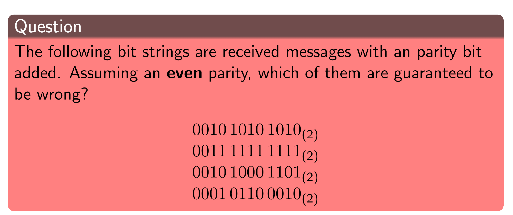

| Even parity | n even | n odd |
| --- | --- | --- |
| Then b = | 0 | 1 |

- 1 - b = 0, but the number of 1's is odd => it is wrong
- 2 - b = 1, the number of 1's is odd => might be correct
- 3 - b = 1, the number of 1's is even => it is wrong
- 4 - b = 0, the number of 1's is even => might be correct

## Q2 Parity bits
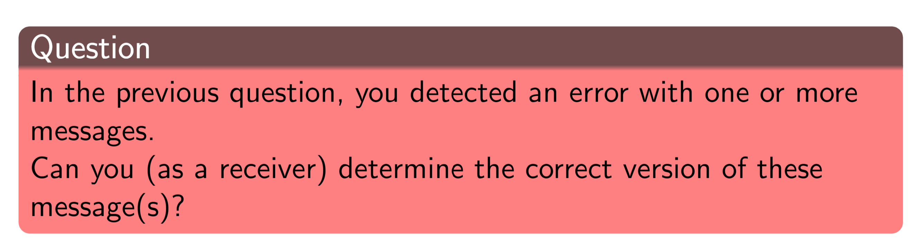
No, there is no way to determine the correct version, because the parity bit only gives information about the parity of the number of 1's and does not give any information related to the position at which there are 1's

## Q3 Parity bits
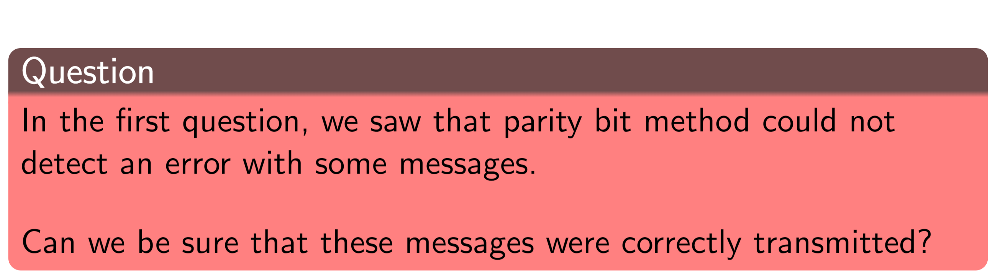
No, we cannot be sure that these messages were correctly transmited, that is because we only know that the parity bit and the parity of the number of 1's is equal, yet, if there is an even number of bit chagnes (the same number of 1's bits become 0 bits and 0 bits become 1's) we could have a false positive, meaning that the parity stays the same but the message is different.

## Q1 Parity Words
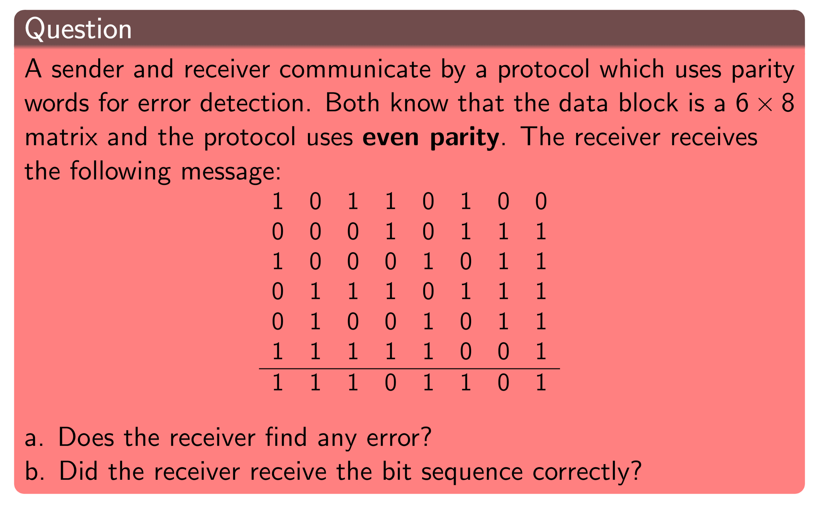

a. No, it seems like after XoRing all the data blocks( inlcuding the parity block) the result would be 0, meaning that no errors could be found by the receiver.
~~Yes, the receiver finds errors, that is because when using even parity: "the result should be all 0s as we XOR the checksum with itself"~~

b. We are not sure if the received bit sequence is correct. Even though no erros could be found by the receiver, parity words cannot detect an even number of bit flips that affect the same parity bit/column, e.g., if the first bit in the first and the second block are flipped (and no other bits), the detection fails.

## Q1 Internet CheckSum
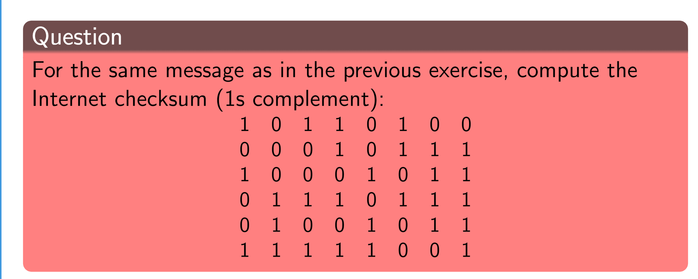
Oioioioi...

The sum is: 

| Sum |
| ------ |
| x x x 1 0 1 1 0 1 0 0 |
| x x x 0 0 0 1 0 1 1 1 |
| x x x 1 0 0 0 1 0 1 1 |
| x x x 0 1 1 1 0 1 1 1 |
| x x x 0 1 0 0 1 0 1 1 |
| x x x 1 1 1 1 1 0 0 1 + |
| --------------------- |
| x x x 0 0 0 1 0 0 0 1 = sum |
| x 1 1 0 0 0 0 0 0 0 0 = r |
| --------------------- |
| sum + r = result|
| 0 0 0 1 0 0 0 1      |
| 0 0 0 0 0 0 1 1      |
|                      |
| 0 0 0 1 0 1 0 0 = result |
| 1 1 1 0 1 0 1 1 = result after 1's complement|

## Q1 CRC
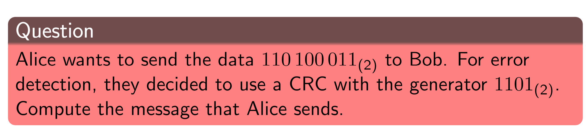
idk?=) not sure how the division work

## Q2 CRC
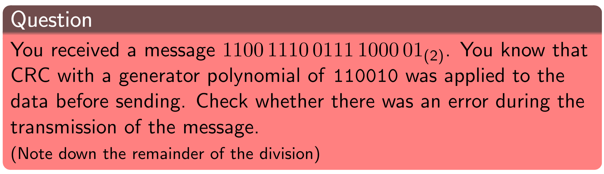
see if the division by the generator has no remainder

## Q3 CRC
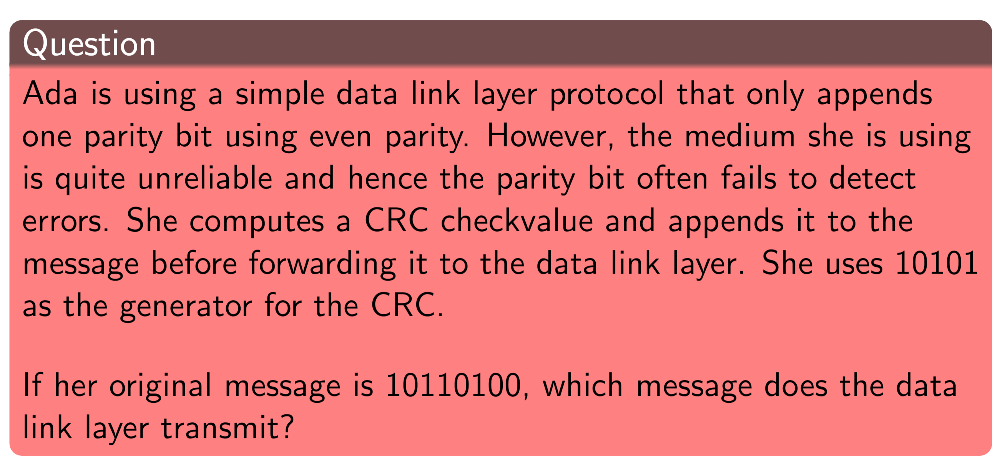
first compute the CRC so that you know what message you send to the data-link layer, then you add the parity bit to it.

# Error correction
## Q1 Parity Blocks
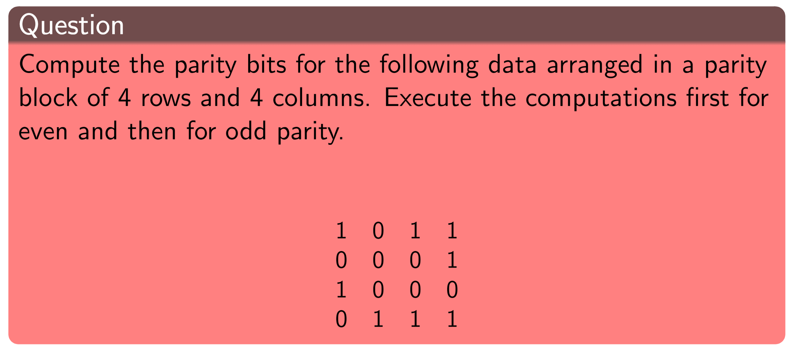

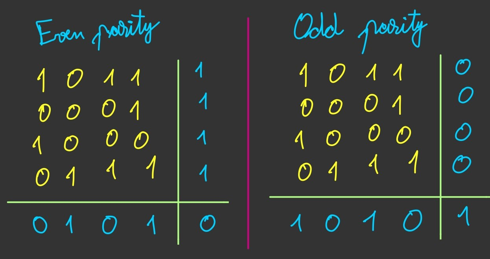

## Q1 Hamming Code
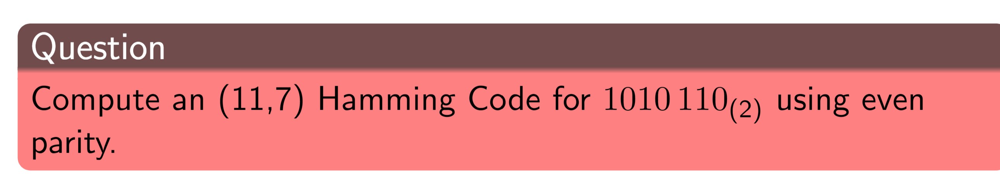

## Q2 Hamming Code
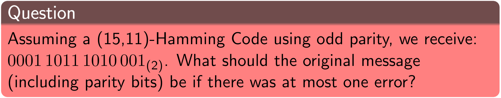