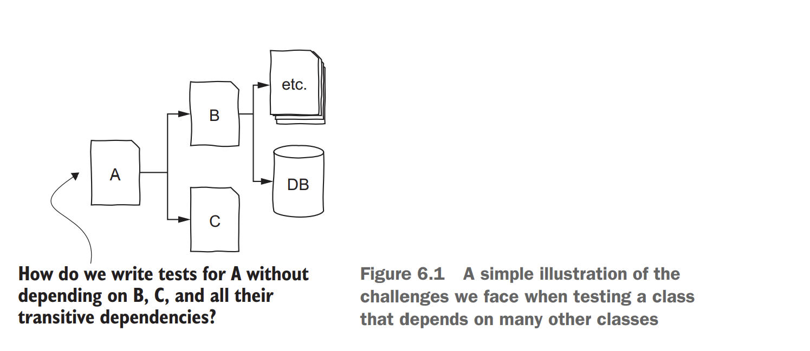
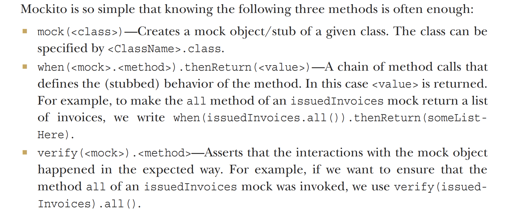
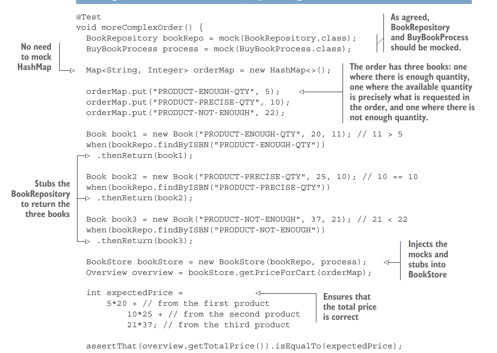
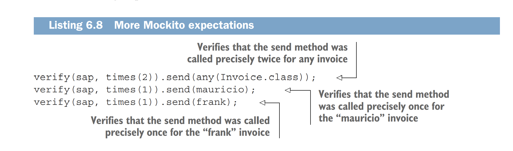

<link rel="stylesheet" type="text/css" href="../styles.css">

<!--  -->

<!--  
 
!  -->

# 6. Test Doubles and Mocks

 Test doubles 
 - Create an object to
mimic the behavior of component B (“it looks like B, but it is not quite B” (Slim Shady - 2000)) 

Advantages of simulating the behavior of other objects:
-  More control 
 - We can tell these fake objects what to do
-  Simulations are faster 
 - It will return what it was configured to return, and it will cost nothing in terms of time
-  Developers are enabled to reflect on how classes should interact with each other 

## Dummies, fakes, stubs, spies and mocks

 Dummy Objects 
 - Passed to the class under test but never used. 

 Fake Objects 
 - Real working implementations of the class they simulate. Hovewever, they do the same task in a simpler way.

 Stubs 
 - Hard-coded answers to the calls performed during the test. 

 Mocks 
 - Act like stubs in the sense that you can configure how they reply if a method is called. But, they also save all the interactions and allow you to make assertions afterward.

 Spies 
 - Wrap themselves around the real object and observe its behavior. Recording all the interactions with the underlying object we are spying on. 

## Mockito 

## When to mock?

Pragmatically, developers often mock or stub the following types of dependencies:
-  Dependencies that are too slow 
-  Dependencies that communicate with external infrastructure 
-  Cases that are hard to simulate   - If we want to force the dependency to behave in a hard-to-simulate way, mocks or stubs can help 

On the other hand, developers tend not to mock or stub the following dependencies:
-   Entities  
-   Native libraries and utility methods  
-  Things that are simple enough  

## Mock Example

## Nice to know mokito verify
