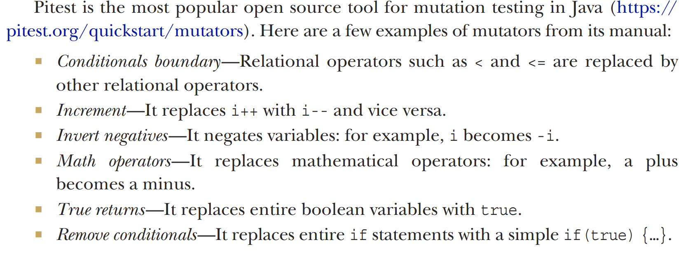

<link rel="stylesheet" type="text/css" href="../styles.css">

# 3.Structural testing and code coverage

<!--  -->

<!--  
 
!  -->

 Structural testing 
 - Using the structure of the source code to guide testing. 

 Understanding Coverage criteria 
 - Means Understanding structural testing techniques 

## Steps to follow:

1. Specification-based testing  

2. Read the implementation 
 - Understand the main coding decisions made by the
developer.

3. Run the devised test suite with a code coverage tool

4. For each piece of code that is not covered:
- Understand why that piece of code was not tested.
- Decide whether the piece of code deserves a test.
- If a test is needed, implement an automated test case that covers the missing piece.

5. Look for other interesting tests you can devise based on the code. 

## Code coverage Criteria

 Line Coverage
- At least one test case that covers the line under test.

 Branch Coverage
- Takes into consideration the fact that branching instructions make the program behave in different ways, depending how
the instruction is evaluated.

 Condition + Branch Coverage
- Considers not only possible branches but also each condition of each branch statement.

 Path Coverage
- Covers all the possible paths of execution of the program.

!While ideally this is the strongest criterion, it is often impossible or too expensive to achieve. 

##  Complex conditions and the MC/DC coverage criterion

!Modified condition/decision coverage(MC/DC) maximizes the number of bugs they can identify while minimizing the effort/cost of building the test suite. 
MC/DC explained:
https://www.youtube.com/watch?v=HzmnCVaICQ4

Basically, choose the best combo so you have a pair of independent tests for each part of the condition,
also, the number of paths is 2n, and we can do only n+1 in this way.

 Loop boundary adequacy criterion
 - Criterion used to decide when to stop testing a loop. A test suite satisfies
this criterion if and only if for every loop
- There is a test case that exercises the loop zero times
-  There is a test case that exercises the loop once.
- There is a test case that exercises the loop multiple times.

## Mutation Testing
 Mutation Testing
 - purposefully inserting a bug in the existing code and checking whether the test suite breaks.

### How pitest mutates things

# 4. Designing contracts
 Contracts  - Clearly establish what the class requires as pre-conditions, what the class provides as post-conditions, and what invariants always hold for the class 

## Pre-conditions and post-conditions
Pre-conditions- Ensure that the input values received by a method adhere to what it requires.

Post-conditions- Ensure that the method returns what it promises to other methods.

! Strong and weak pre- and post-conditions. (they exist =)))  

## Invariants

! Pre-conditions should hold before a method’s execution, and post-conditions should hold after a method’s execution. Now we move on to conditions that must always hold before and after a method’s execution.  

## Changing contracts, and the Liskov substitution principle

Liskov substitution principle (LSP)- A subclass may be used as a substitution for a base class without breaking the expected behavior of the system.

