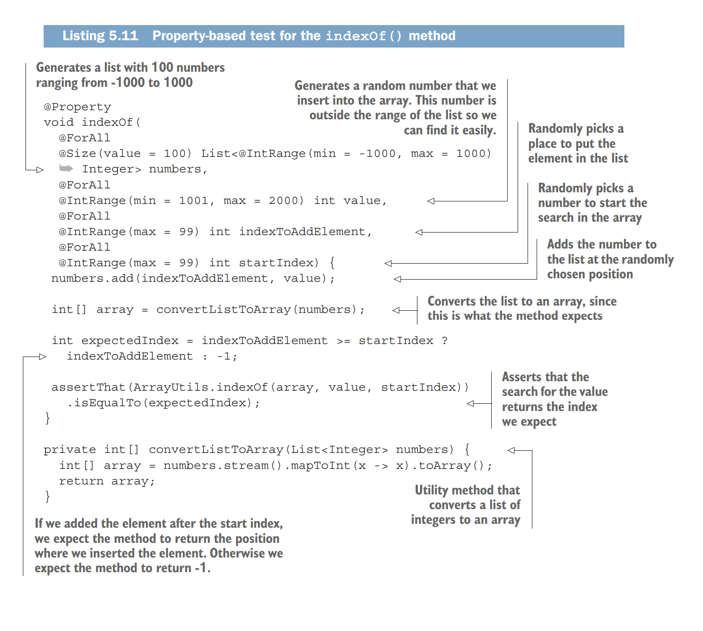
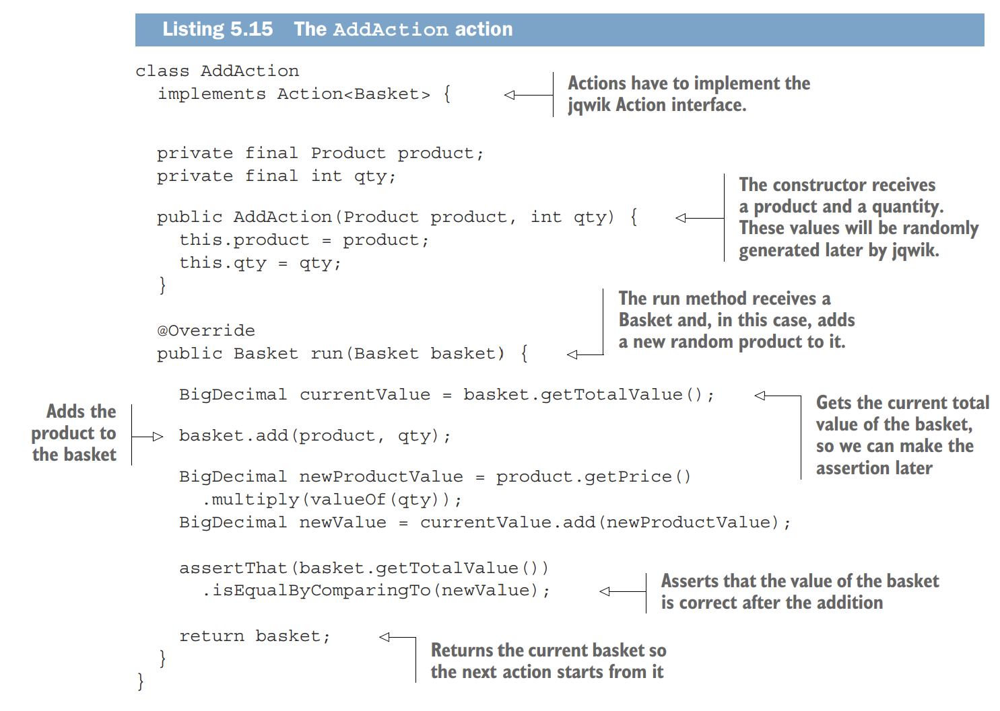
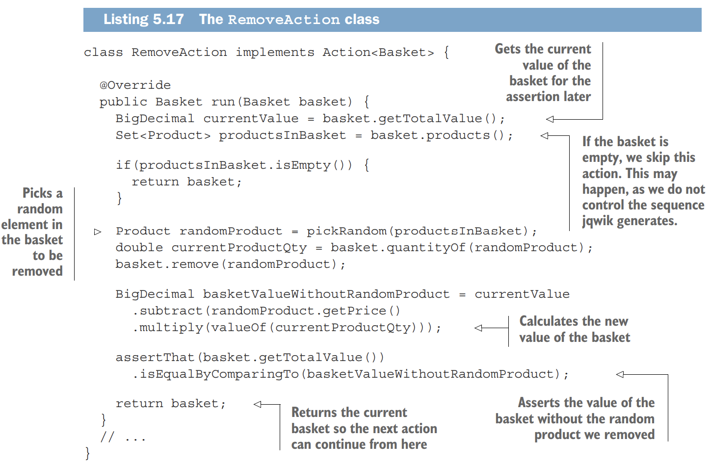
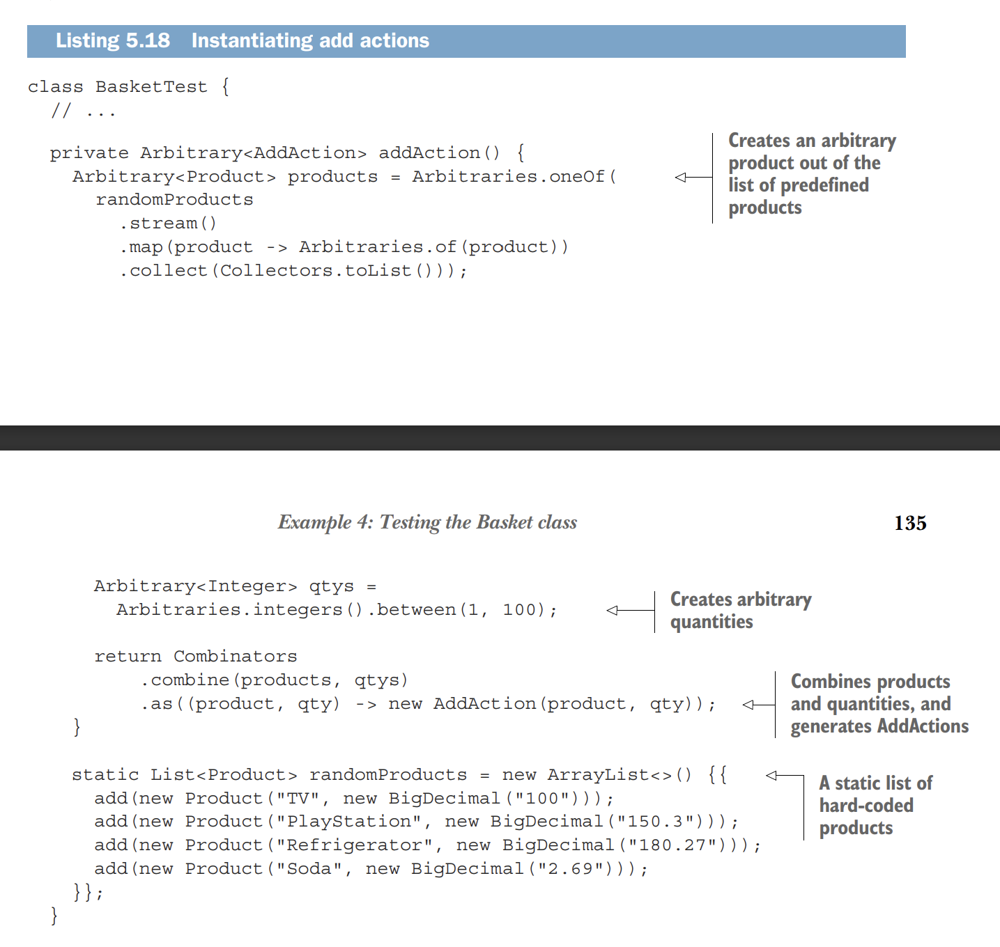
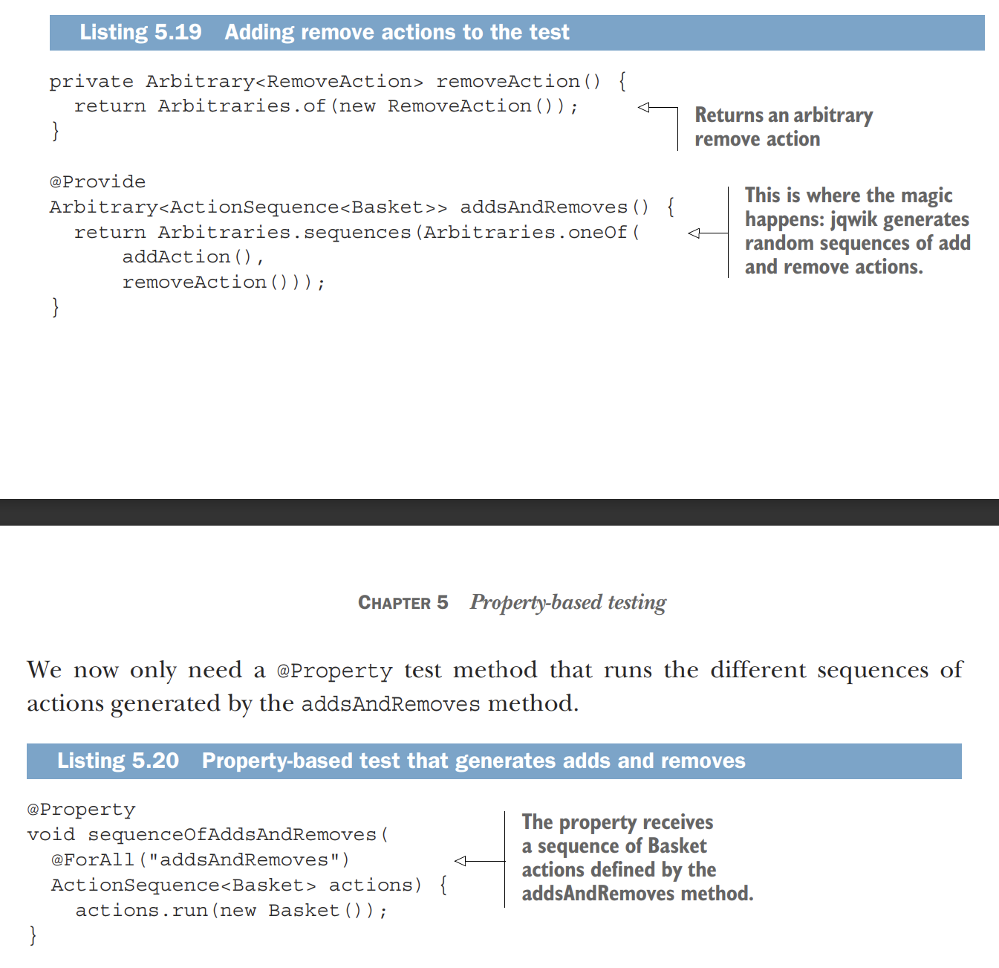
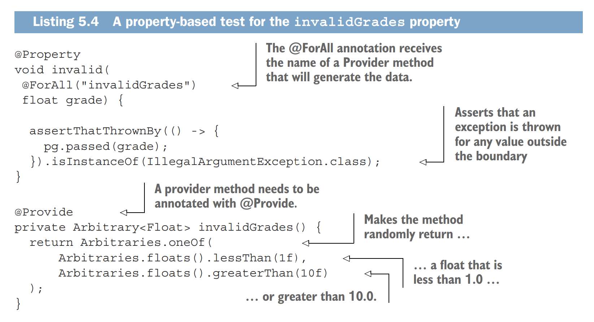

<link rel="stylesheet" type="text/css" href="../styles.css">

# 5.Property-based testing

<!--  -->

<!--  
 
!  -->

 Example-based Testing 
 - Pick one concrete example from all the possible ones.

 Property-based Testing 
 Define a property (or a set of properties) that the program should adhere to, and the test framework tries to find a counterexample that causes the program to break with these properties.

## Example of Property-based Testing

## Actions and ActionSequences

## How to test for invalidity

