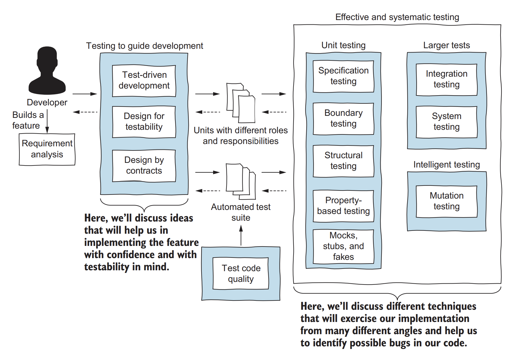
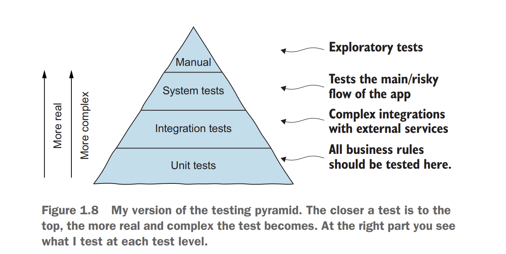
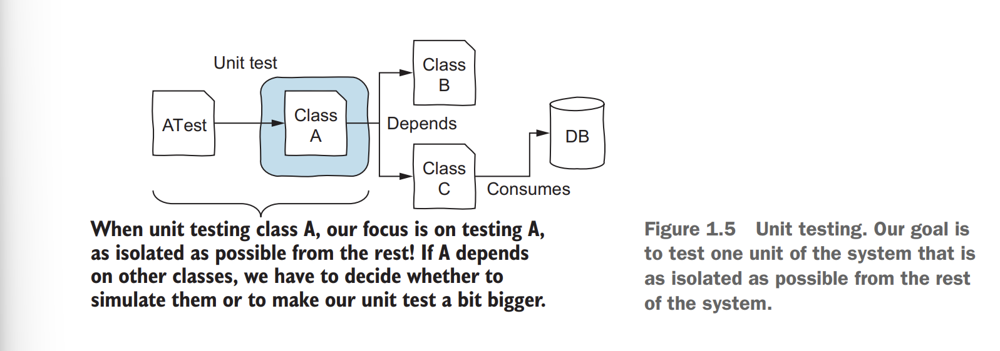
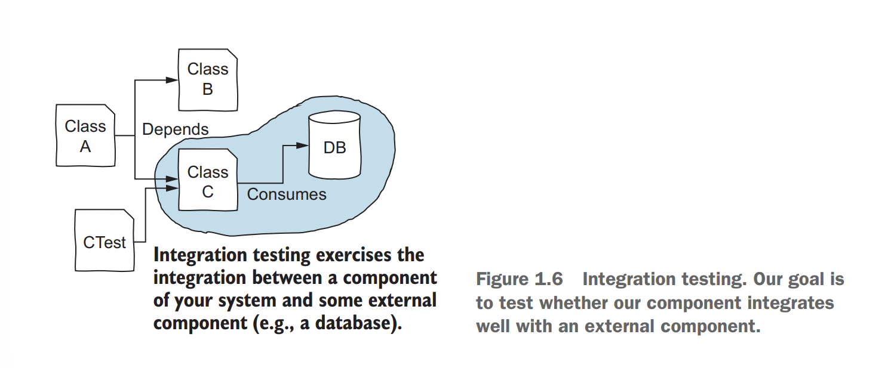
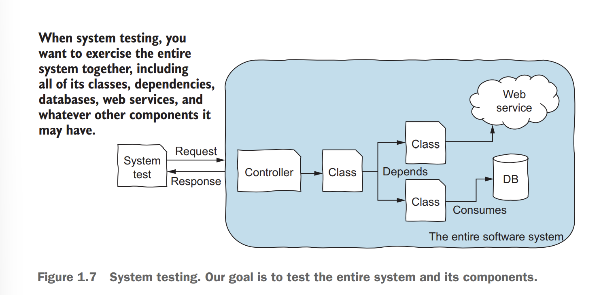
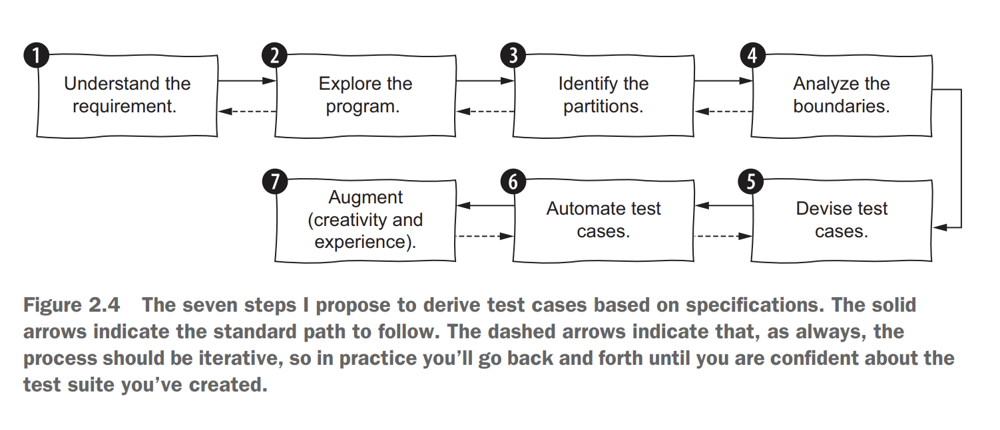

<link rel="stylesheet" type="text/css" href="../styles.css">

# 1.Effective and systematic software testing

Property-based testing 
 - assert a specific property
- property-based testing framework runs the same test 100 times, each time with a different random input 

Domain testing 
 - a technique that breaks down the requirements into small parts and use them to derive test cases 

### Testing effectively and systematically
 Effective 
 - means we focus on writing the right tests

 Systematic 
 - means that for a given piece of code, any developer should come up with the same test suite.
 
## Principles of software testing 
!
Exhaustive testing is impossible \
 Therefore, there is a need for effective testing. 

!
Knowing when to stop testing \
Our goal should always be to
maximize the number of bugs found while minimizing the resources we spend on finding those bugs.

Pesticide paradox 
 - every method you use to prevent or find bugs leaves a residue of subtler bugs against which those methods are ineffectual. 

! Testers
must use different testing strategies to minimize the number of bugs left in the software. 

! No matter what testing you do, it will never be perfect or enough
 - As Dijkstra used to say, “Program testing can be used to show the presence of bugs, but
never to show their absence.” 

### Verification is not validation
 Absence-of-errors fallacy  
 - Focusing solely on verification and not on validation.

! Verification is
about having the system right; validation is about having the right system.

## The testing pyramid 

 Unit testing  
 - Test a single feature of the software, purposefully ignoring the other units of the system.

 Integration testing  
 - Test the integration between our code and external parties.
-  Integration testing aims to test multiple
components of a system together, focusing on the interactions between them instead of testing the system as a whole

 System testing  
 - Test the entire
system together, including all of its classes, dependencies, database , web services, and whatever other components it may have.

# 2.Specification-based testing
 Boundary testing  
 - making the program behave correctly when inputs are near a boundary.

 On Point  
 - the point that is on
the boundary.

 Off Point  
 - the point closest to the
boundary that belongs to the partition the on point does not belong to.

 In Points  
 - points that make the condition true.

 Out Points  
 -  points that make the condition false.

# The seven steps of specification-based testing

1. Understand the requirement, inputs, and outputs  
 - make an overall idea about what needs to be tested.

2. Explore the program 
 if you did not write the program yourself, a very good way to determine what it does (besides reading the documentation) is to play with it.

3. Judiciously explore the possible inputs and outputs, and identify the partitions  

4. Identify the boundaries  
 - analyze the boundaries of all the partitions you devised in the previous step.

5. Devise test cases based on the partitions and boundaries 
 - combine all the partitions in the different categories to test all possible combinations of inputs.

6. Automate the test cases 

7. Augment the test suite with creativity and experience 

!  How far should specification testing go? \
 If the cost is high, it may be
wise to invest more in testing, explore more corner cases, and try different techniques to ensure quality. But if the cost is low, being less thorough may be good enough. 

https://cppi.sync.ro/materia/programare_dinamica_0.html

https://catalin.francu.com/Academics/MITclasses.html

http://courses.csail.mit.edu/6.857/2020/handouts

http://www.ai.mit.edu/courses/6.863/