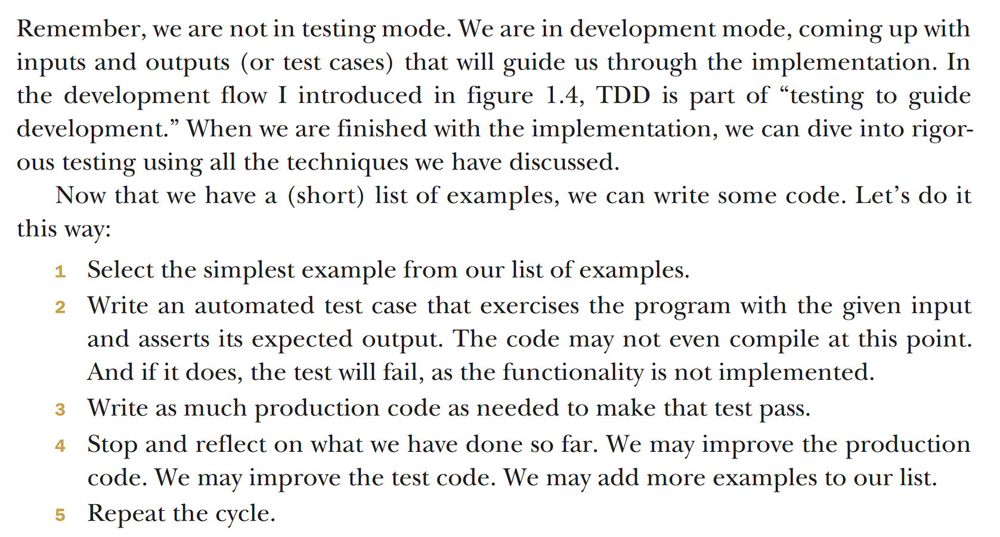
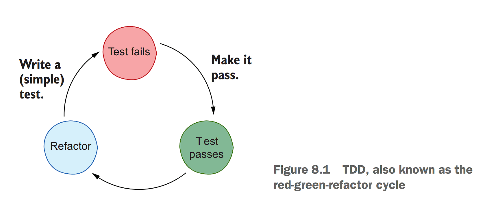

<link rel="stylesheet" type="text/css" href="../styles.css">

<!--  -->

<!--  
 
!  -->

# 8.Test driven development

 Test driven development(TDD)
 - Start by writing a test representing the next small feature we want to implement. 

## The TDD Cycle

 Regression bugs
 - Bugs introduced to previously working behavior

## The Red Green refactor cycle(TDD)

## Advantages of TDD:
-  Looking at the requirements first   

-  Full control over the pace of writing production code   

-  Quick feedback   

-  Testable code   

-  Feedback about design   