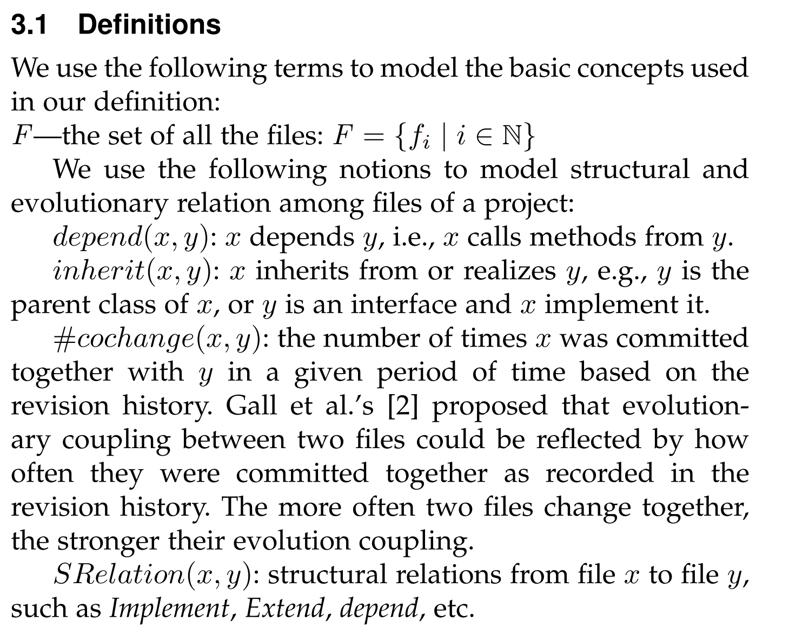
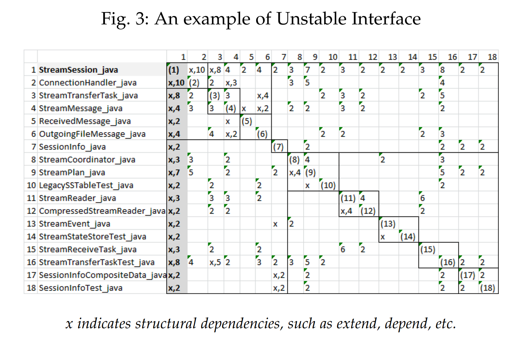
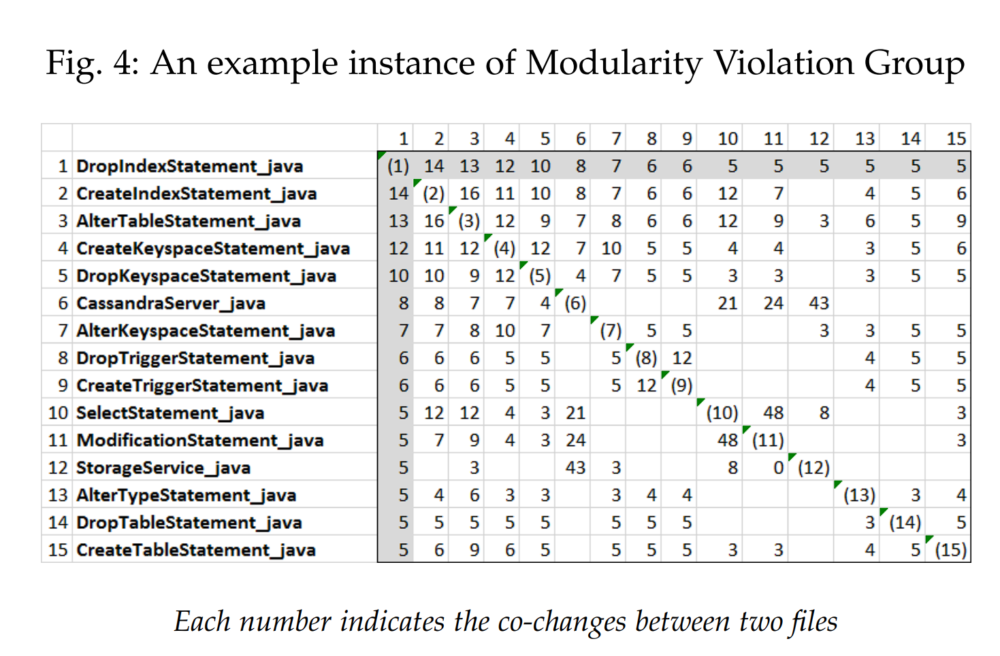
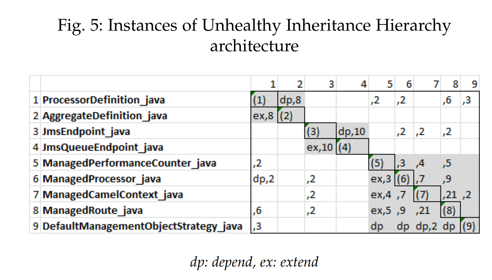
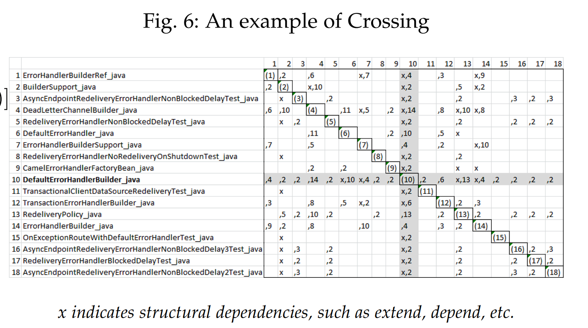
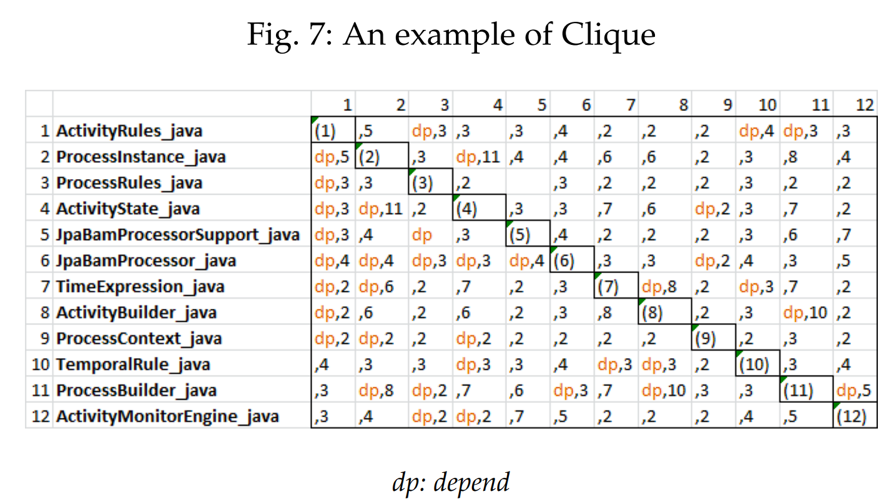
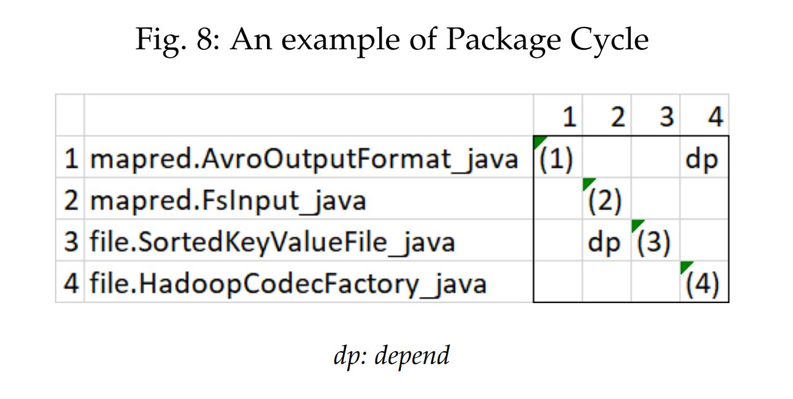

# Architecture Anti-patterns: Automatically Detectable Violations of Design Principles

<link rel="stylesheet" type="text/css" href="../styles.css">

<!--  -->

<!--  
 
!  -->

### Things to be shown in the study:
- files involved in these architecture anti-patterns are more error-prone and change-prone
- the more anti-patterns a file is involved in, the more error-prone and change-prone it is
- while all of our defined architecture anti-patterns contribute to file’s error-proneness
and change-proneness, Unstable Interface and Crossing contribute the most by far

# 1.Introduction
 Architecture anti-patterns 
 - Connections among files that violate design principles and impact bug-proneness and change-proneness

### The six architecture anti-patterns:
-  Unstable Interface   - if influential files have high change rates, then multiple files depending on them have to be changed as a consequence 
! An influential interface with many dependents should remain stable.  
-  Modularity Violation Groups   - A set of modularity violation file pairs (two files without structural relations but changed together frequently in revision history)  
! Truly independent modules should evolve independently  
-  Unhealthy Inheritance Hierarchy   - This anti-pattern identifies the violation of the Liskov Substitution principle or Dependency Inversion Principle. This anti-pattern includes cases where the parent class depends on one or more of  this subclasses, or the client of an inheritance hierarcy depends on both the parent class and its children. These cases undermine the objective of an inheritance hierachy to enable polymorphism => this structure propagates bugs and changes to files that depend on this inheritance hierarchy.  
-  Crossing   - A file that has both high fan-in and high fan-out, and changes often together with its dependents and the files it depends on, is often at the center of maintenance activities. Since files involved in this anti-pattern form a cross shape in a Design Structure Matrix, we call it Crossing.  
-  Clique   - Cyclic dependency is a well-know design problem. Instead of detecting pair-wise cycles. Files in each Clique instance are tightly coupled with one or more dependency cycles  
! Clique is a set of files that form a strongly connected graph with direct or indirect cycles among files.  
-  Package Cycle   - Dependency cycles between packages violates the basic design principle of forming a hierarchical structure. 
! Changes to a file in one package often cause unexpected changes to files in other packages due to the cycle of dependencies between them.  

### Research questions
-  RQ1  Do the files involved in architecture anti-pattern consume significantly more maintenance effort than other files in a project? 
-  RQ2   If a file is involved in greater numbers of architecture anti-patterns, is it more error-prone and/or change-prone?

-  RQ3 Do different types of architecture anti-patterns have different impacts on a file’s overall error-proneness and change-proneness?

# 2.Background

 Design Rule Theory 
-  should be structured by design rules and independent modules. 
-  design rules are often manifested as the important design decisions, which decouple the rest of the system into independent modules 
-  a design rule is typically manifested as
an interface or abstract class 
-  if a Strategy Pattern is implemented, then the strategy interface is considered as the design rule which decouples the context and concrete strategies into independent modules 

 Design Rule Hierarchy (DRH) 
-  clusters the file relation of a system into a hierarchical structure. 
-  within such a hierarchy, files in layer Li should only depend on files in the higher layers, Li−1 to L1, and files in layer Li should not depend on files in the lower layers, Li+1 to Ln. Hence files in the first layer, L1, should contain most influential interfaces or abstract classes, which do not depend on files in other layers.
-  files in the same layer are decoupled into a set of modules that are mutually independent from each other. Thus the changes, addition, even replacement to a module will not influence other modules within the same layer
-  independent modules in the bottom layer of a design rule hierarchy are most valuable, because changes to these modules will not affect the rest of the system 

 Design Structure Matrix (DSM) 
-  used to  visualize file relations 
-   a square matrix, in which rows and columns are labeled with file names in the same order 
-  an annotation in the cell in row x, column y, c(rx, cy), indicates that there is a dependency relation between file x and file y 

 Design Rule Space 
-  model the fact that the architecture of a software system can and should be represented as a set of overlapping design spaces, each reflecting an unique aspect of the architecture 
-  each feature implemented, or each pattern applied can be modeled as an individual design space. 
-  each DRSpace contains one or more “leading files”, typically design rules that all the other files within the design space depend on directly or indirectly. In other words, files within a DRSpace are architecturally connected. 
-  if an inheritance hierarchy is implemented, all files involved in the inheritance tree could form a DRSpace led by the parent class 
-   is a subset of files connected by one or more relations, such as inheritance, call, etc. 
-  for any non-trivial project, there are numerous DRSpaces 
-  majority of error-prone files can be captured by just a few DRSpaces, suggesting that most error-prone files in a project are architecturally connected
-  named these DRSpace  Architecture Roots 

# 3. ARCHITECTURE ANTI-PATTERNS
### A well-modularized system should have the following features: 
-  design rules have to be stable: neither error-prone nor change-prone. 
-  if two modules are truly independent, then they should only depend on design rules, but not on each other. 
-  independent modules should be able to be changed, or even replaced, without influencing each other, as long as the design rules themselves remain unchanged. 

! The importance of design rules, that is, abstractions, are also reflected in the Liskov substitution, Interface segregation, and Dependency inversion principles. T 

! Summarized six types of recurring problems into a suite of Architecture Anti-Patterns, each violating one or more design principles and/or design rule theory. 

## Architecture anti-patterns
! For each architecture anti-pattern, we now introduce its rationale, description, and formalization  

### Unstable Interface (UIF)
-  Rationale  - important and influential abstractions (design rules) should be stable. Otherwise their bugs and changes can be propagated to multiple files.  ! unstable or poorly-designed abstractions are often related to high-maintenance  
-  Description  If a highly influential file (files with a large number of dependents) is changed frequently with other files as shown in the revision history, then we call it an Unstable Interface 
-  Formalization 
    -  StructImpactthr  threshold of the structural impact scope of a file, fi . If the number of its dependents is larger than the threshold, we consider fi to be a candidate unstable interface. 
    -  HistoryImpactthr  threshold of the number of co-changed dependents of fi. This requires that fi not only has more than StructImpactthr dependents, but also has more than HistoryImpactthr of these dependents changed together frequently with it 
    -  cochangethr  threshold of co-change frequency. If two files are committed together more times than this threshold, we consider these two files to have changed together “frequently” and that they are evolutionarily coupled. 

! For a file fi, if it has more than StructImpactthr dependents, and more than  HistoryImpactthr of these dependents changed together with it more than cochangethr times, we consider fi to be an Unstable Interface.    

### Modularity Violation Group (MVG).
-  Rationale  independent modules can be changed or even replaced without influencing each other. Modularity Violation - describes two structurally independent modules that change together frequently, meaning that they are not truly independent
-  Description  In a Modularity Violation Group, there exists a core file, fcore, which all other files are not structurally related to, but have frequently changed together with. To identify a Modularity Violation Group (MVG), our tool first generates all filesets by considering each file in a project as a core file, then greedily searches a fileset that covers most violated file pairs as a MVG, until the union of all the MVGs covers all violated file pairs in a project. 
-  Formalization  just a formula explained. 
-  cochangethr  

<!--  
 
!  -->

### Unhealthy Inheritance Hierarchy (UIH)
-  Rationale  object-oriented design principles are violated in the implementation of an inheritance hierarchy. The two most frequent problems are: 
    - a parent class depends on one of its children;
    - a client class of the hierarchy depends on both the base class and its children. 
    Both cases violate:
        - Liskov Substitution principle, since the parent class can no longer be a placeholder substitutable by any of its children. 
        - The Design Rule Theory because the parent class cannot be a decoupling design rule. 
        - The Dependency Inversion Principle since a client should depend on abstractions, not on concretions.
-  Description  We consider an inheritance hierarchy to be problematic if it falls into one of the following two cases:
    - Given an inheritance hierarchy containing one parent file, fparent, and one or more children, Fchild, there exists a child file fi satisfying depend(fparent, fi)
    - Given an inheritance hierarchy containing one parent file, fparent, and one or more children, Fchild, there exists a client fj of the hierarchy, that depends on both the parent and one or more of its children.

-  Formalization  

### Crossing (CRS).
-  Rationale  
-  Description  
-  Formalization  

### Clique (CLQ).
-  Rationale  
-  Description  
-  Formalization  

### Package Cycle (PKC).
-  Rationale  
-  Description  
-  Formalization  
