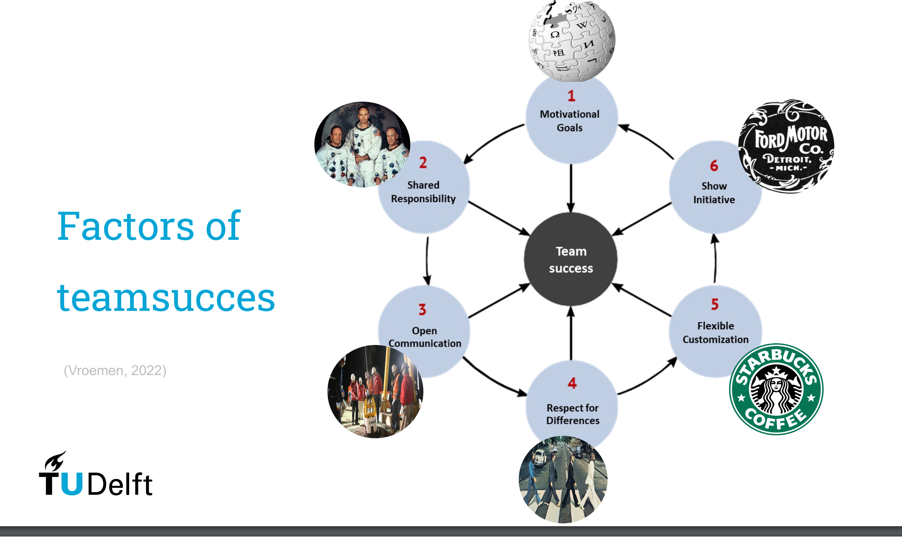
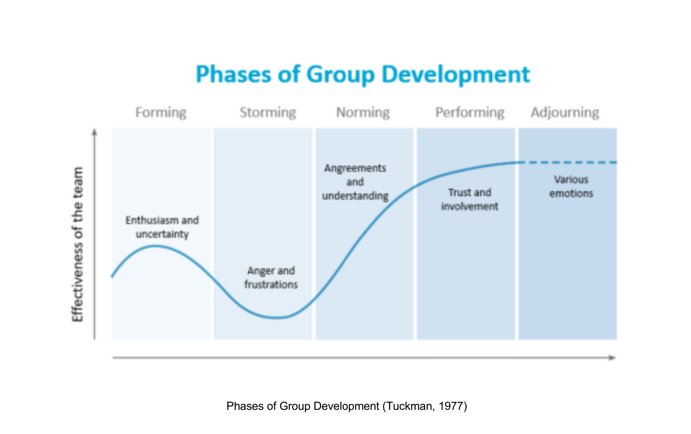
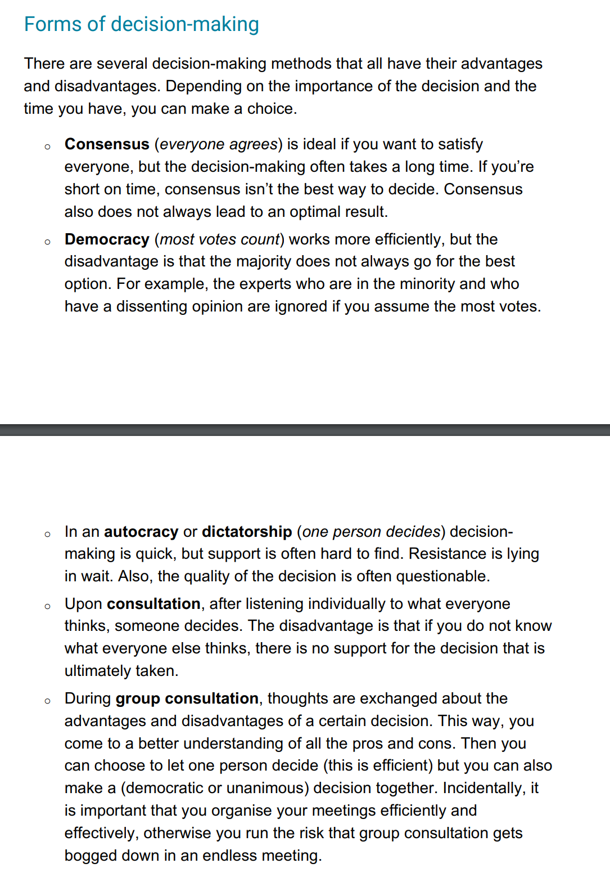
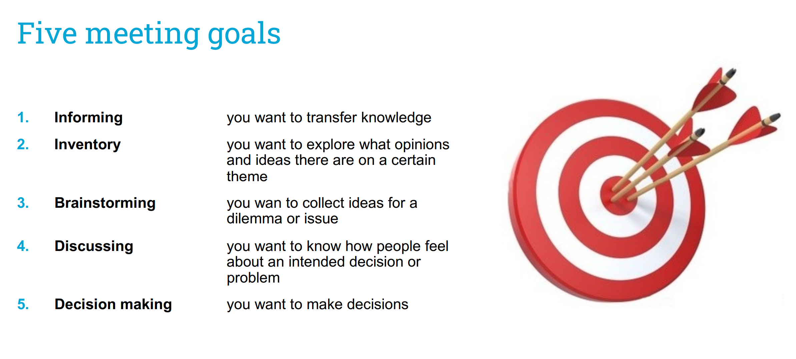
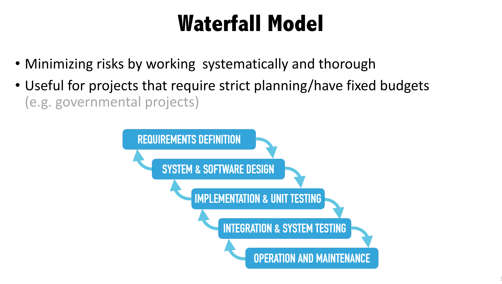
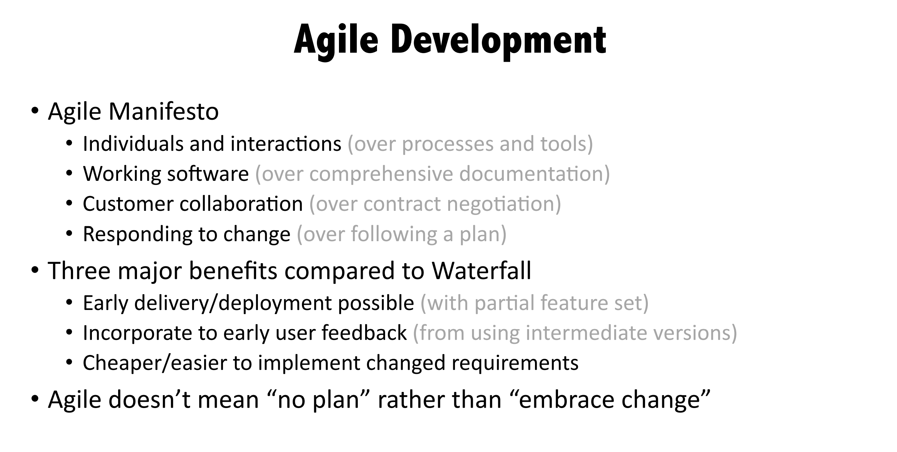
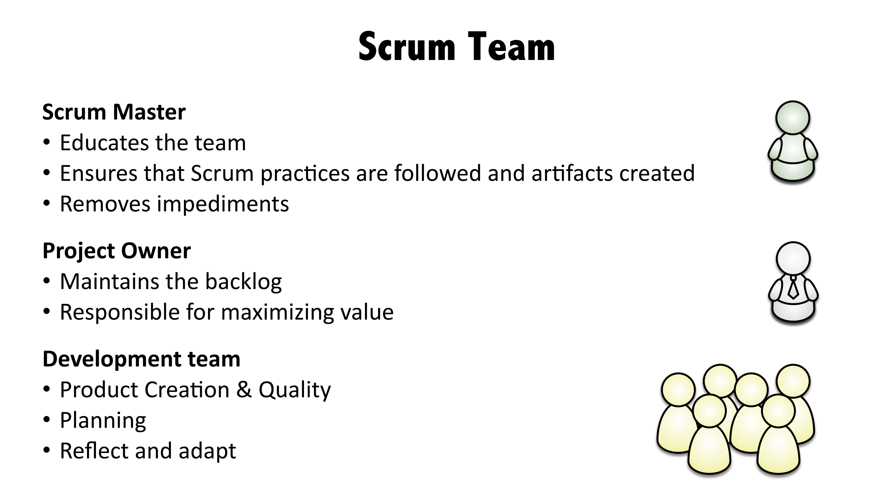
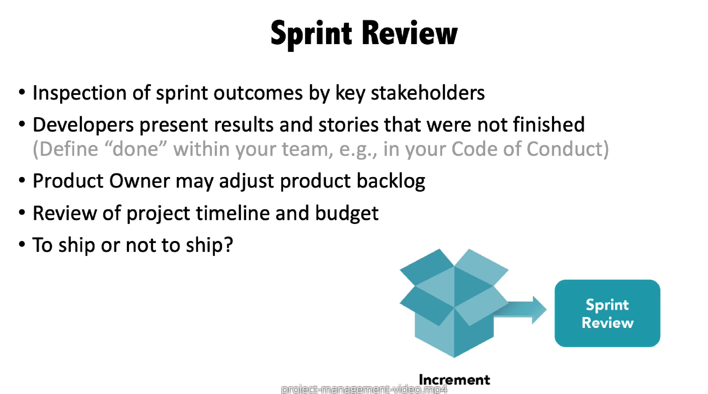
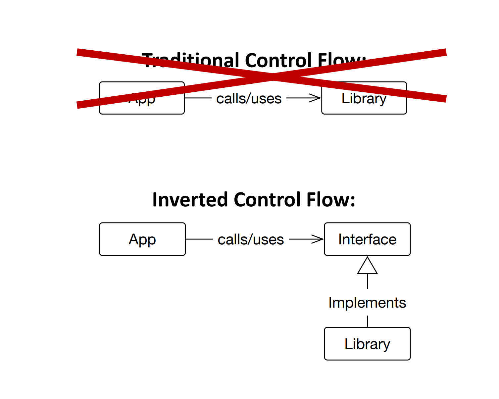

# Team success

# Tuckman's phases of group formation

# Decision making

# GroupThink

# Five meeting goals

# Chair interventions
- Naming process:  “I notice that we are digressing and running out of time. I
think dnow how we're going to handle this"
- Invite to say something:  “I am curious about your opinion on this subject"
- Give feedback: "I've heard you say this three times now. The point has been
understood by all. Could you indicate what you still want to do with this?”

# Waterfall Model

# Agile

# SCRUM

- Sprint is the period when you get updates on the project, the goal is that at the end of the sprint you create a shipeable product("an increment")
- The development time when there is no interferance with the stakeholders
- The daily scrum when developers meet

- Sprint retrospective, you search for how to improve

# Functional & Non-Functional Requirments
- functional: Something that the user wants to be able to do in the app
- non-functional(thingies that require something to work as they want but not necesarily smth touchable):
    - Product
    - Organizational
    - External

# Dependency Injection & Dependency Inversion
- Dependency Inversion: "The high-level code
no longer depends on
the low-level code.
Instead, both depend
on abstractions." 
- Dependency Injection Types: Field and Constructor injections

# Serialization and Deserialization
- deserialization - in utils
- serialization - controller
